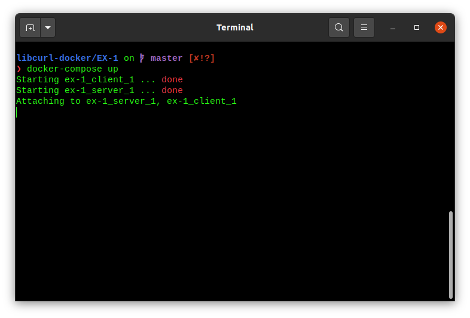
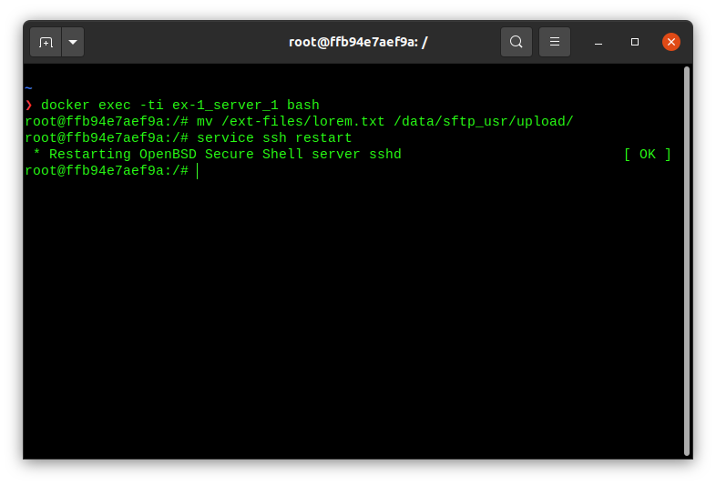
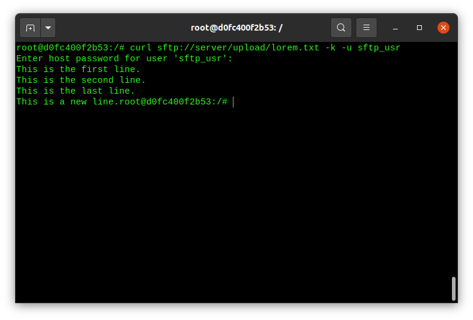
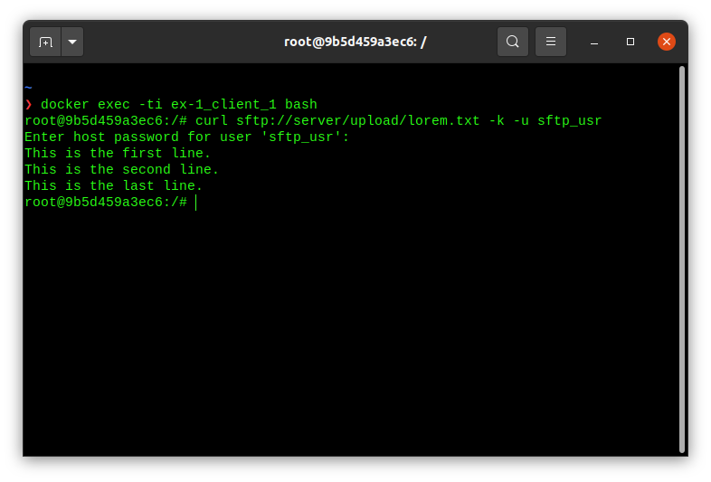
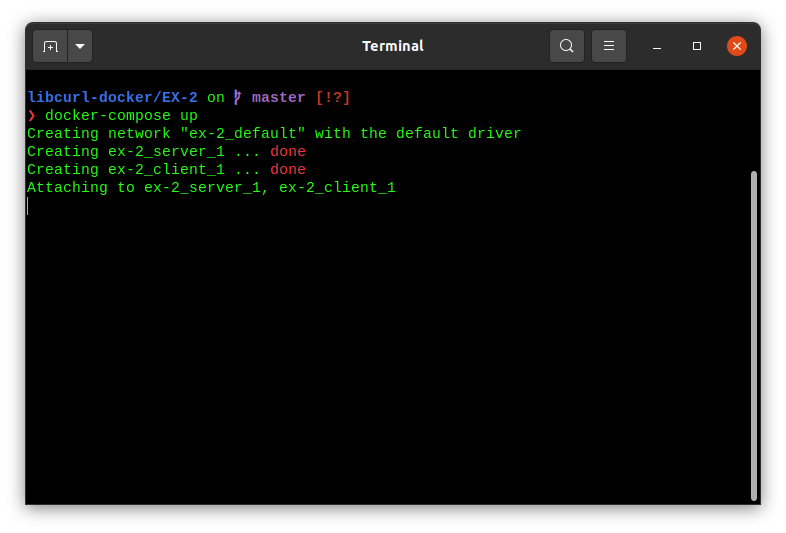
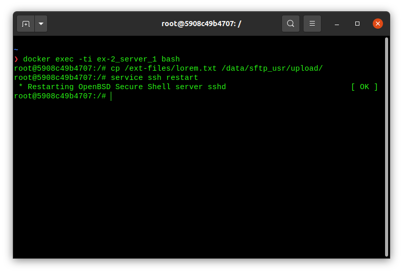
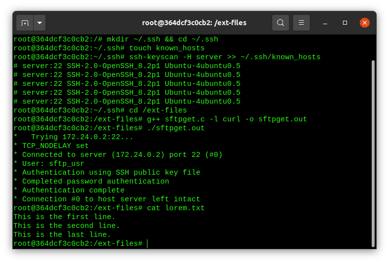

# Libcurl docker

- [Libcurl docker](#libcurl-docker)
  - [EX 1: file transfer using curl (command line)](#ex-1-file-transfer-using-curl-command-line)
    - [setup network](#setup-network)
    - [server: setup](#server-setup)
    - [client: file transfer](#client-file-transfer)
    - [references](#references)
  - [EX 2: file transfer using libcurl (C API)](#ex-2-file-transfer-using-libcurl-c-api)
    - [setup network](#setup-network-1)
    - [server: setup](#server-setup-1)
    - [client: file transfer](#client-file-transfer-1)
    - [references](#references-1)
  - [EX 3: file transfer using libcurl (C++ API)](#ex-3-file-transfer-using-libcurl-c-api)
    - [references](#references-2)
  - [EX 4: file transfer using libcurl (CMake build)](#ex-4-file-transfer-using-libcurl-cmake-build)

## EX 1: file transfer using curl (command line)

Set up 2 docker containers:

- server
- client

Goal: `server` has a file `lorem.txt` which we want to fetch from the client using [libcurl](https://everything.curl.dev/libcurl).

clean-up previous setups: `docker system prune`

pull server image: `docker pull maksimdrachov/sftp-server`

pull client image: `docker pull maksimdrachov/sftp-client-curl`

### setup network

`cd ~/libcurl-docker/EX-1`

Start containers/network: `docker-compose up`

`docker-compose.yml`:

```yml
version: "3.7"

services:
    server:
        image: maksimdrachov/sftp-server-curl
        stdin_open: true
        tty: true
        volumes:
            - ./server-volume:/ext-files/
    client:
        image: maksimdrachov/sftp-client-curl
        stdin_open: true
        tty: true
```



### server: setup

Open bash terminal:

`docker exec -ti ex-1_server_1 bash`

Copy `lorem.txt` to `/data/sftp_usr/upload`:

`cp /ext-files/lorem.txt /data/sftp_usr/upload/`

Restart ssh:

`service ssh restart`



### client: file transfer

`docker exec -ti ex-1_client_1 bash`

from `client` terminal (password is `sftp`): 

```
curl sftp://server/upload/lorem.txt -k -u sftp_usr
```



To save the file add `-o lorem.txt`:

```
curl sftp://server/upload/lorem.txt -k -u sftp_usr -o lorem.txt
```



### references

[docker-openssh-server](https://github.com/linuxserver/docker-openssh-server)

## EX 2: file transfer using libcurl (C API)

### setup network

`cd ~/libcurl-docker/EX-2`

pull server image: `docker pull maksimdrachov/sftp-server`

Pull libcurl server image: `docker pull maksimdrachov/sftp-client-libcurl`


Start containers/network: `docker-compose up`

`docker-compose.yml`:

```yml
version: "3.7"

services:
    server:
        image: maksimdrachov/sftp-server-curl
        stdin_open: true
        tty: true
        volumes:
            - ./server-volume:/ext-files/
    client:
        image: maksimdrachov/sftp-client-libcurl
        stdin_open: true
        tty: true
        volumes:
            - ./client-volume:/ext-files/
```



### server: setup

`docker exec -ti ex-2_server_1 bash`

Copy `lorem.txt` to `/data/sftp_usr/upload`:

`cp /ext-files/lorem.txt /data/sftp_usr/upload/`

Restart ssh:

`service ssh restart`



### client: file transfer

`docker exec -ti ex-2_client_1 bash`

Add known host:

```
mkdir ~/.ssh && cd ~/.ssh
touch known_hosts
ssh-keyscan -H server >> ~/.ssh/known_hosts
```

File transfer:
```
cd /ext-files
g++ sftpget.c -l curl -o sftpget.out
./sftpget.out
```



### references

[curl/docs/examples/sftpget.c](https://github.com/curl/curl/blob/master/docs/examples/sftpget.c)

[C API](https://everything.curl.dev/libcurl)

[libcurl examples](https://everything.curl.dev/libcurl/examples)

[How to add an SSH fingerprint to known_hosts](https://www.techrepublic.com/article/how-to-easily-add-an-ssh-fingerprint-to-your-knownhosts-file-in-linux/)

[CURLOPT_USERPWD explained](https://curl.se/libcurl/c/CURLOPT_USERPWD.html)

## EX 3: file transfer using libcurl (C++ API)

### references

[C++ API](https://everything.curl.dev/libcurl/cplusplus)

## EX 4: file transfer using libcurl (CMake build)