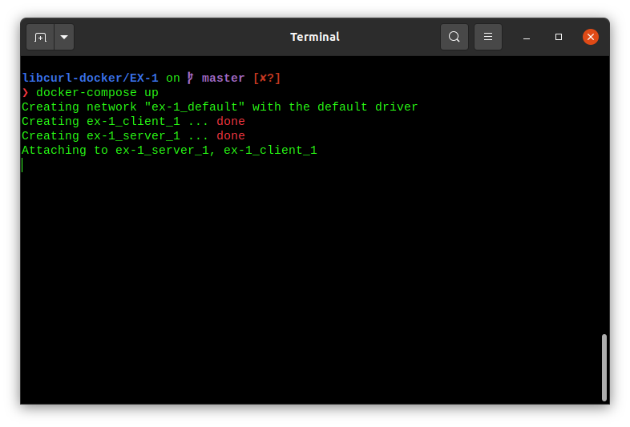
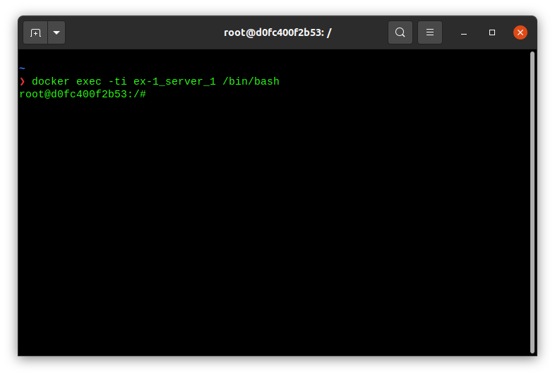
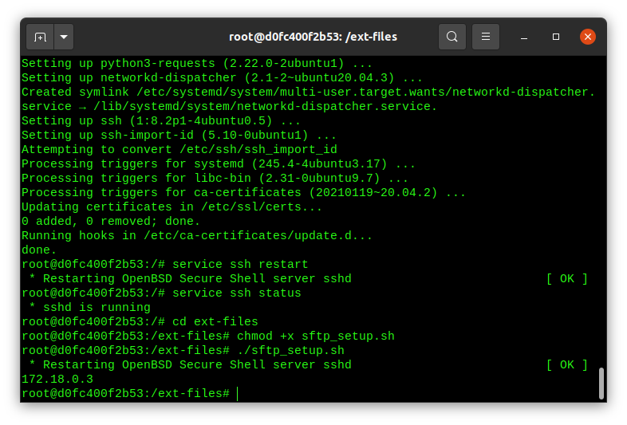
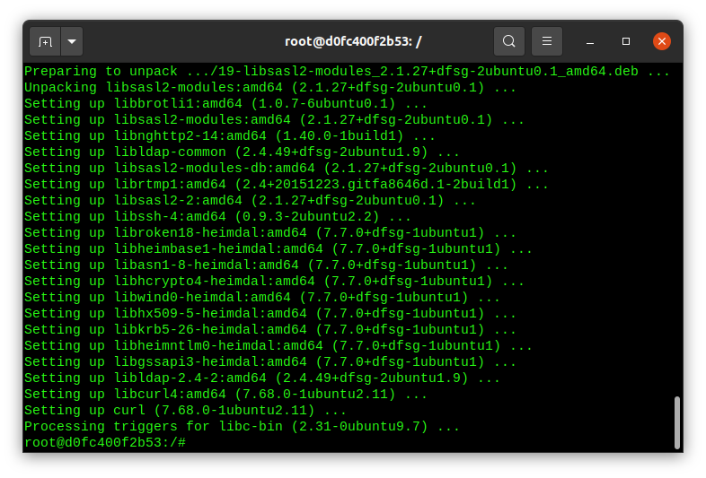
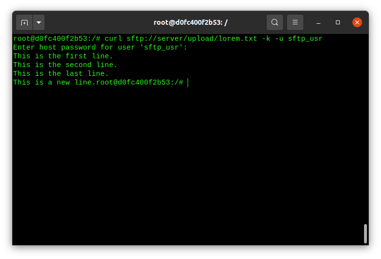

# Libcurl docker

## EX 1: file transfer using curl (command line)

Set up 2 docker containers:

- server
- client

Goal: `server` has a file `lorem.txt` which we want to fetch from the client using [libcurl](https://everything.curl.dev/libcurl).

### step 1: setup docker containers

clean-up previous setups: `docker system prune`

#### setup network

[docker-openssh-server](https://github.com/linuxserver/docker-openssh-server)

`cd ~/libcurl-docker/EX-1`

Start containers/network: `docker-compose up`

`docker-compose.yml`:

```yml
version: "3.7"

services:
    server:
        image: ubuntu:20.04
        stdin_open: true
        tty: true
        volumes:
            - ./ext-files:/ext-files/
    client:
        image: ubuntu:20.04
        stdin_open: true
        tty: true
```



#### terminal for server

`docker exec -ti ex-1_server_1 /bin/bash`



#### terminal for client

`docker exec -ti ex-1_client_1 /bin/bash`


#### server setup

```
apt-get update 
apt-get install ssh -y 
service ssh restart
service ssh status
cd ext-files
chmod +x sftp_setup.sh
./sftp_setup.sh
```



Move `lorem.txt` to `/data/sftp_usr/upload`:

`mv /ext-files/lorem.txt /data/sftp_usr/upload/`

#### client setup

```
apt-get update
apt-get -y install curl
```



#### client: file transfer using command-line

from `client` terminal (password is `sftp`): 

```
curl sftp://server/upload/lorem.txt -k -u sftp_usr
```



To save the file add `-o lorem.txt`:

```
curl sftp://server/upload/lorem.txt -k -u sftp_usr -o lorem.txt
```

## EX 2: file transfer using libcurl (c library)

[`curl/docs/examples/sftpget.c`](https://github.com/curl/curl/blob/master/docs/examples/sftpget.c)